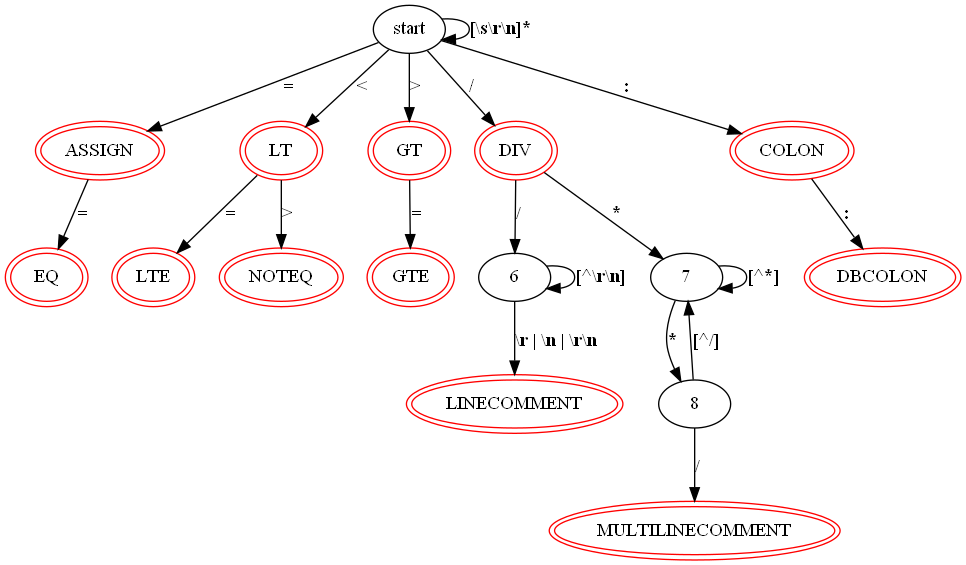
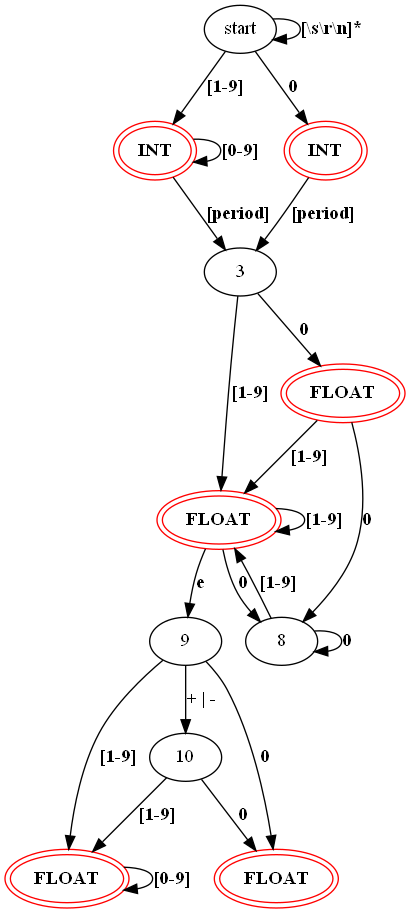
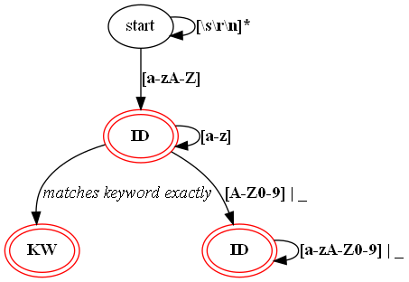
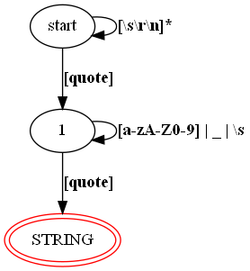

# Assignment 1 Document
___
## Atomic lexical elements of the language
| Element  	|    	| Expression                         	|
|----------	|-----	|------------------------------------	|
| **id**    | ::= 	| letter alphanum*                   	|
| alphanum 	| ::= 	| letter &#124; digit &#124; _          |
|**integer**| ::= 	| nonzero digit* &#124; 0               |
| **float** | ::= 	| integer fraction [**e**[+&#124;−] integer]|
| fraction 	| ::= 	| .digit* nonzero &#124; **.0**         |
| letter   	| ::= 	| **a..z &#124; A..Z**                  |
| digit    	| ::= 	| **0..9**                               	|
| nonzero  	| ::= 	| **1..9**                               	|
| **string**| ::= 	| “ alphanum “                       	|
| character | ::=   | alphanum | space
## Operators, punctuation and reserved words
|	|	|	|	|	|	|	||
|----	|---	|----	|---	|----	|---------	|---------	|----------	|
| == 	| + 	| &#124;| ( 	| ;  	| if      	| public  	| read     	|
| <> 	| - 	| &  	| ) 	| ,  	| then    	| private 	| write    	|
| <  	| * 	| !  	| { 	| .  	| else    	| func    	| return   	|
| \>  	| / 	| ?  	| } 	| :  	| integer 	| var     	| main     	|
| <= 	| = 	|    	| \[ 	| :: 	| float   	| class   	| inherits 	|
| >= 	|   	|    	| ] 	| "  	| string  	| while   	| break    	|
|    	|   	|    	|   	|    	| void    	|         	| continue 	|
## Comments
  - Block comments start with /* and end with */ and may span over multiple lines.
  - Inline comments start with // and end with the end of the line they appear in.
___

## Lexical Specification
 - **id**: `[a..zA..Z]([a..zA..Z] | [0..9] | _ )*`
 - **integer**: `[1..9][0..9]* | 0`
 - **string**: `"([a..zA..Z] | [0..9] | _ | space)*"`
 - **float**: `([1..9][0..9]* | 0)\.([0..9]*[1..9] | 0)(e(+ | -)?[1..9][0..9]* | 0)`
 - **For operators, punctuation and reserved keywords**: Can match directly based on above tables.
 - **Single line comments**: `//[^\r\n]*`
 - **Multiline  comments**: `\*.*\*/`
___

## Finite State Automatons
### Finite Automaton for Operators, Punctuation and Comment tokens

### Finite Automaton for Integer and Float tokens

### Finite Automaton for ID and Keyword tokens

### Finite Automaton for String tokens

___

## Design
For this project, I have chosen to implement the compiler in the Rust programming language.

In the `token.rs` file, I have defined an enum `TokenType` with every variant representing a token the compiler supports, including the Error token type. Each token type is attached to a regular expression, which are defined in the `token_regex.rs` file.
For the `TokenType::Error` variant, it holds a variant of the `InvalidTokenType` enum, which represents the different possible error tokens.

The  `Token` struct represents a fully parsed token, which includes the type of token, the lexeme and the line number where the token is. I have grouped up the token type and the lexeme into it's own struct called `TokenFragment` so that callers have a way to have a "Token" without a line number.

In the `lexer.rs` file is my implementation of a Lexer. I have defined a the trait (Similar to a Java interface or a pure virtual C++ class) `LexerAnalyzer` which describes an interface of possible operations for a Lexer.
I have a struct called `LexerInput` which wraps a `String` and provides easy ways to construct an input for my Lexer either from a string or from a file. Finally, I've implemented a Lexer through the struct `MyLexerAnalyzer` which implements the `Lexer` trait and owns a `input: LexerInput`, the input to lex, and a `idx: usize` which keeps track of where in the input we are. 

In the `utils.rs` file, I have a few functions that help the Lexer parse the input. The function `is_valid_character` is used to know if the next character will possibly lead to a punctuation, operator or comment token.
The `parse_kw_or_id` function takes in the input string to parse, and returns either a keyword, id or error token.
The `parse_number` function takes in the input string to parse, and returns either an integer, float or error token.
The `parse_op_or_punct` function takes in the input string to parse, and return either a punctuation, operator, comment or error token.
The `parse_string` function takes in the input string to parse, and return either a string or error token.
___

## Use of tools
 - The Rust programming language: I chose to implement the compiler in Rust. Rust is a multi-paradigm programming language that guarentees memory safety, is relatively fast (similar to C/C++) and provides powerful tools to build a compiler (pattern matching, algebreic data types, etc...). I also had a bit of familiarity with the language and wanted to further my own proficiency in it.

 - Crates (Rust equivalent of libraries): 
    - [Regex](https://github.com/rust-lang/regex): This crate provides a library for parsing, compiling, and executing regular expressions, which is useful when testing a lexeme for a token.
    - [Lazy Static](https://github.com/rust-lang-nursery/lazy-static.rs): Since you cannot declare/initialize static file variables (like C++), this crate provides a macro that enables you to do so. I use this to mostly in conjuction with the `Regex` crate so that my regular expressions are precompiled and available to any file in my project.
    
- Other tools:
    - CLion: My IDE of choice for writing Rust.
    - Git/Github: VCS
    - VSCode: Mostly for text editing and visualizing non-text files.
    - GraphViz: For creating the Finite Automatons required for the assignment. 